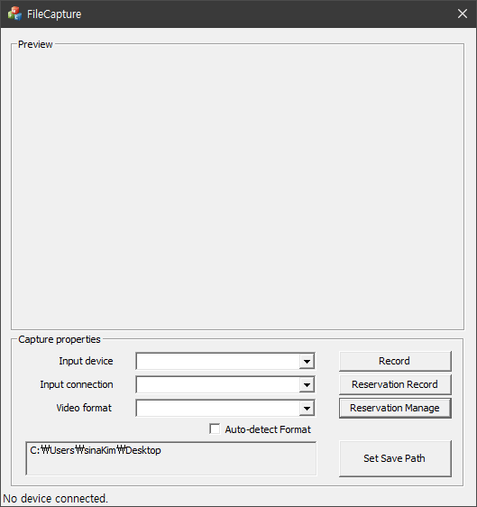
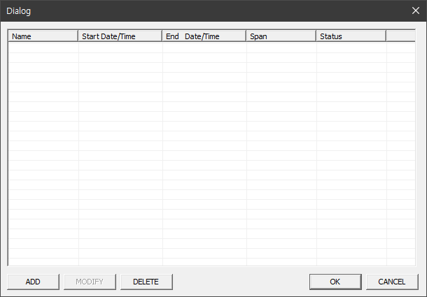
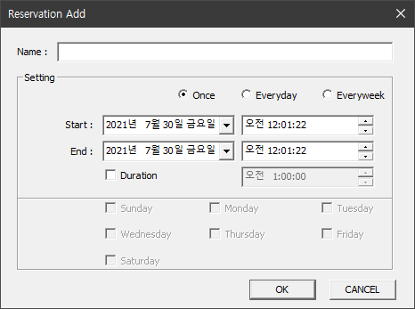

# ReservationRecordingProgram
- MFC 기반의 GUI
- [BlackMagic Design](https://www.blackmagicdesign.com/kr)사 의 [DeckLink](https://www.blackmagicdesign.com/kr/products/decklink) 캡처보드를 활용
- BlackMagic DeckLink SDK 활용

> 코드 및 실행파일은 비공개입니다.

## Preview
- main window

- reservation manage dialog

- reservation add dialog

